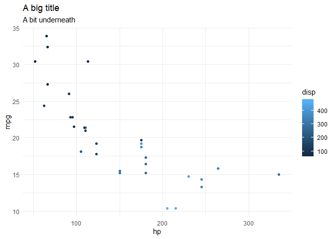
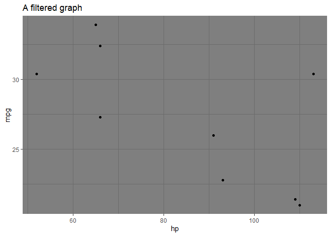

# learn-simple-R-with-tidyverse

The goal of `learn-simple-R-with-tidyverse` is to provide a gentle
inroduction to R, focusing on utilising the `tidyverse` packages. To use
this guide you will need to install [R](https://www.r-project.org/) and
[RStudio](https://rstudio.com/).

## R, Packages and the Tidyverse

R is a statistical programming language supported that is free and
open-source. One of it’s biggest strengths is the community contribution
of ‘packages’, which are collections of code and data wrapped up and
freely distributed for people to use. Because of the freedom in how R is
written there are often multiple ways to do exactly the same thing. This
can be confusing.

The [tidyverse](https://www.tidyverse.org/) is a collection of packages
that follow a similar style of coding, which I find easier to understand
and harder to create weird errors within. There is a solid video
introduction [here](https://www.youtube.com/watch?v=WM2hctrlMts) - just
watch the first half, especially if you are not sure where to type stuff
in RStudio.

To install the tidyverse you need to run the code
`install.packages('tidyverse')`.

To use the tidyvese collection of packages you need to load the
tidyverse.

``` r
# Anything following a # is a comment
# Below we load the tidyverse collection of packages
library(tidyverse)
#> -- Attaching packages -------------------------------------------------------------------------------- tidyverse 1.3.0 --
#> <U+2713> ggplot2 3.2.1     <U+2713> purrr   0.3.3
#> <U+2713> tibble  2.1.3     <U+2713> dplyr   0.8.3
#> <U+2713> tidyr   1.0.0     <U+2713> stringr 1.4.0
#> <U+2713> readr   1.3.1     <U+2713> forcats 0.4.0
#> -- Conflicts ----------------------------------------------------------------------------------- tidyverse_conflicts() --
#> x dplyr::filter() masks stats::filter()
#> x dplyr::lag()    masks stats::lag()
```

Bonus package: You might want to try out the package `lubridate` as well
if you ever have to deal with dates and times. It is not part of the
tidyverse per se but is commonly included in tidyverse style workflow.

## Looking at data, tibbles

R automatically loads in some default data sets. If you type `mtcars` or
`iris` into the console then R will show you the data - which is just a
table of values (called a data frame). The first cool thing about the
tidyverse is the tibble; which is just a souped up version of a data
frame.

Note the `<-` operator is used to assign data to a name (the thing on
the left of the `<-` is the name, the thing on the right the data).
Because it is so often used the shortcut `Alt -` is handy.

``` r
# create tibble versions of the mtcars and iris tables
tib_mtcars <- as_tibble(mtcars)
tib_iris <- as_tibble(iris)

# See how mtcars prints now...
tib_mtcars
#> # A tibble: 32 x 11
#>      mpg   cyl  disp    hp  drat    wt  qsec    vs    am  gear  carb
#>    <dbl> <dbl> <dbl> <dbl> <dbl> <dbl> <dbl> <dbl> <dbl> <dbl> <dbl>
#>  1  21       6  160    110  3.9   2.62  16.5     0     1     4     4
#>  2  21       6  160    110  3.9   2.88  17.0     0     1     4     4
#>  3  22.8     4  108     93  3.85  2.32  18.6     1     1     4     1
#>  4  21.4     6  258    110  3.08  3.22  19.4     1     0     3     1
#>  5  18.7     8  360    175  3.15  3.44  17.0     0     0     3     2
#>  6  18.1     6  225    105  2.76  3.46  20.2     1     0     3     1
#>  7  14.3     8  360    245  3.21  3.57  15.8     0     0     3     4
#>  8  24.4     4  147.    62  3.69  3.19  20       1     0     4     2
#>  9  22.8     4  141.    95  3.92  3.15  22.9     1     0     4     2
#> 10  19.2     6  168.   123  3.92  3.44  18.3     1     0     4     4
#> # … with 22 more rows
```

You can also take a closer look in RStudio by typing `View(tib_mtcars)`.
See if you can test out the following examples, but use the `iris` data
set. The ‘pipe’ operator, `%>%`, work like saying ‘take this *and then*
do this’. It’s a bit tricky to type so you can use `Ctrl-Shift-M` to
type it instead.

``` r
names(mtcars) # gets the variable names
#>  [1] "mpg"  "cyl"  "disp" "hp"   "drat" "wt"   "qsec" "vs"   "am"   "gear"
#> [11] "carb"

mtcars %>% 
  names()  # does the same thing. 
#>  [1] "mpg"  "cyl"  "disp" "hp"   "drat" "wt"   "qsec" "vs"   "am"   "gear"
#> [11] "carb"

mtcars %>% 
  names   # you can skip the () if no other inputs to the 'names' function are needed
#>  [1] "mpg"  "cyl"  "disp" "hp"   "drat" "wt"   "qsec" "vs"   "am"   "gear"
#> [11] "carb"

tib_mtcars %>% 
  select(mpg, disp, hp)
#> # A tibble: 32 x 3
#>      mpg  disp    hp
#>    <dbl> <dbl> <dbl>
#>  1  21    160    110
#>  2  21    160    110
#>  3  22.8  108     93
#>  4  21.4  258    110
#>  5  18.7  360    175
#>  6  18.1  225    105
#>  7  14.3  360    245
#>  8  24.4  147.    62
#>  9  22.8  141.    95
#> 10  19.2  168.   123
#> # … with 22 more rows

tib_mtcars %>% 
  select(starts_with('c'))
#> # A tibble: 32 x 2
#>      cyl  carb
#>    <dbl> <dbl>
#>  1     6     4
#>  2     6     4
#>  3     4     1
#>  4     6     1
#>  5     8     2
#>  6     6     1
#>  7     8     4
#>  8     4     2
#>  9     4     2
#> 10     6     4
#> # … with 22 more rows

# get the first 3 rows
tib_mtcars %>% 
  slice(1:3)
#> # A tibble: 3 x 11
#>     mpg   cyl  disp    hp  drat    wt  qsec    vs    am  gear  carb
#>   <dbl> <dbl> <dbl> <dbl> <dbl> <dbl> <dbl> <dbl> <dbl> <dbl> <dbl>
#> 1  21       6   160   110  3.9   2.62  16.5     0     1     4     4
#> 2  21       6   160   110  3.9   2.88  17.0     0     1     4     4
#> 3  22.8     4   108    93  3.85  2.32  18.6     1     1     4     1

# Order by a variable
tib_mtcars %>% 
  arrange(mpg, desc(hp)) %>%  # if you wrap a variable in desc() it reverses the order 
  head(4) # head just looks at the top n
#> # A tibble: 4 x 11
#>     mpg   cyl  disp    hp  drat    wt  qsec    vs    am  gear  carb
#>   <dbl> <dbl> <dbl> <dbl> <dbl> <dbl> <dbl> <dbl> <dbl> <dbl> <dbl>
#> 1  10.4     8   460   215  3     5.42  17.8     0     0     3     4
#> 2  10.4     8   472   205  2.93  5.25  18.0     0     0     3     4
#> 3  13.3     8   350   245  3.73  3.84  15.4     0     0     3     4
#> 4  14.3     8   360   245  3.21  3.57  15.8     0     0     3     4
```

## Subsetting and extracting variables

There are *heaps* of ways to do this in R, and this will probably be the
only non-tidyverse thing to show you, and that is the `$` method of
getting a variable. The nice thing about the `$` sign is that it is a
quick way to remind yourself what variables are in the data set, just
type the object followed by a `$` sign (`mtcars$`) and the variables
come up as options.

``` r
mtcars$disp
#>  [1] 160.0 160.0 108.0 258.0 360.0 225.0 360.0 146.7 140.8 167.6 167.6 275.8
#> [13] 275.8 275.8 472.0 460.0 440.0  78.7  75.7  71.1 120.1 318.0 304.0 350.0
#> [25] 400.0  79.0 120.3  95.1 351.0 145.0 301.0 121.0

# the tidyverse way
mtcars %>% 
  pull(disp)
#>  [1] 160.0 160.0 108.0 258.0 360.0 225.0 360.0 146.7 140.8 167.6 167.6 275.8
#> [13] 275.8 275.8 472.0 460.0 440.0  78.7  75.7  71.1 120.1 318.0 304.0 350.0
#> [25] 400.0  79.0 120.3  95.1 351.0 145.0 301.0 121.0

# we can then compute stuff
mean(mtcars$hp)
#> [1] 146.6875

mtcars %>% 
  pull(hp) %>% 
  mean()
#> [1] 146.6875
```

This starts to get more powerful if we subset as well.

``` r
tib_mtcars %>% 
  filter(mpg > 20, hp > 100)
#> # A tibble: 5 x 11
#>     mpg   cyl  disp    hp  drat    wt  qsec    vs    am  gear  carb
#>   <dbl> <dbl> <dbl> <dbl> <dbl> <dbl> <dbl> <dbl> <dbl> <dbl> <dbl>
#> 1  21       6 160     110  3.9   2.62  16.5     0     1     4     4
#> 2  21       6 160     110  3.9   2.88  17.0     0     1     4     4
#> 3  21.4     6 258     110  3.08  3.22  19.4     1     0     3     1
#> 4  30.4     4  95.1   113  3.77  1.51  16.9     1     1     5     2
#> 5  21.4     4 121     109  4.11  2.78  18.6     1     1     4     2

# find the mean mpg of high hp cars
tib_mtcars %>% 
  filter(hp > 100) %>% 
  pull(mpg) %>% 
  mean()
#> [1] 17.45217
```

## Summaries and Grouping

But what if we just want a quick summary of the data? Or summarise by
groups?

``` r
# A generic summary
tib_mtcars %>% 
  summary()
#>       mpg             cyl             disp             hp       
#>  Min.   :10.40   Min.   :4.000   Min.   : 71.1   Min.   : 52.0  
#>  1st Qu.:15.43   1st Qu.:4.000   1st Qu.:120.8   1st Qu.: 96.5  
#>  Median :19.20   Median :6.000   Median :196.3   Median :123.0  
#>  Mean   :20.09   Mean   :6.188   Mean   :230.7   Mean   :146.7  
#>  3rd Qu.:22.80   3rd Qu.:8.000   3rd Qu.:326.0   3rd Qu.:180.0  
#>  Max.   :33.90   Max.   :8.000   Max.   :472.0   Max.   :335.0  
#>       drat             wt             qsec             vs        
#>  Min.   :2.760   Min.   :1.513   Min.   :14.50   Min.   :0.0000  
#>  1st Qu.:3.080   1st Qu.:2.581   1st Qu.:16.89   1st Qu.:0.0000  
#>  Median :3.695   Median :3.325   Median :17.71   Median :0.0000  
#>  Mean   :3.597   Mean   :3.217   Mean   :17.85   Mean   :0.4375  
#>  3rd Qu.:3.920   3rd Qu.:3.610   3rd Qu.:18.90   3rd Qu.:1.0000  
#>  Max.   :4.930   Max.   :5.424   Max.   :22.90   Max.   :1.0000  
#>        am              gear            carb      
#>  Min.   :0.0000   Min.   :3.000   Min.   :1.000  
#>  1st Qu.:0.0000   1st Qu.:3.000   1st Qu.:2.000  
#>  Median :0.0000   Median :4.000   Median :2.000  
#>  Mean   :0.4062   Mean   :3.688   Mean   :2.812  
#>  3rd Qu.:1.0000   3rd Qu.:4.000   3rd Qu.:4.000  
#>  Max.   :1.0000   Max.   :5.000   Max.   :8.000

mtcars %>% 
  group_by(am) %>% # Break the data into groups based on the variable am
  summarise(mpg = mean(mpg),
            hp = mean(hp),
            number_of_cars = n())
#> # A tibble: 2 x 4
#>      am   mpg    hp number_of_cars
#>   <dbl> <dbl> <dbl>          <int>
#> 1     0  17.1  160.             19
#> 2     1  24.4  127.             13

# This is how we would have got it for just the one case
mtcars %>% 
  filter(am == 1) %>% 
  pull(mpg) %>% 
  mean()
#> [1] 24.39231

tib_mtcars %>% 
  group_by(gear > 3) %>% # You can group according to a condition
  tally() # tally is a lazy way of just counting 
#> # A tibble: 2 x 2
#>   `gear > 3`     n
#>   <lgl>      <int>
#> 1 FALSE         15
#> 2 TRUE          17

# even lazier counting
tib_mtcars %>% 
  count(am)
#> # A tibble: 2 x 2
#>      am     n
#>   <dbl> <int>
#> 1     0    19
#> 2     1    13
```

## Visualising

The library `ggplot2` is one of the best packages in R. It uses an
approach to data visualisation called the *grammar of graphics*, which
is essentially a concept of layering different elements to the
visualisation. It’s best articulated with an example.

``` r
mtcars %>% 
  ggplot(aes(x = hp, y = mpg, colour = disp)) + # Note that this is +, not %>%. We are now 'laryering' the graphical elements
  geom_point() + # This adds a 'geom' (visual element) to the data. If you type geom_ you should see the different options
  ggtitle("A big title", subtitle = "A bit underneath") +
  theme_minimal()
```

<!-- -->

``` r

# We can combine this with the filtering...
mtcars %>% 
  filter(am ==1, mpg > 20) %>% 
  ggplot(aes(x = hp, y = mpg)) + 
  geom_point() +
  ggtitle("A filtered graph") +
  theme_dark()
```

<!-- -->
